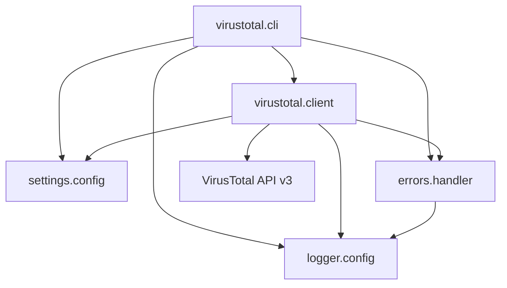

# VirusTotal API


CLI client and Python library for the [VirusTotal API v3](https://docs.virustotal.com/reference/overview). Submit files and URLs for malware analysis, and pull threat intelligence reports for IP addresses and domains -- all from the command line.

## Overview

VirusTotal aggregates data from dozens of antivirus engines and security tools into a single API. This project wraps that API in a typed Python client with a CLI interface, structured logging, and a domain-specific error hierarchy.

The project is organized as a uv workspace monorepo with four packages that follow a shared-component architecture. The `virustotal` package provides the API client and CLI, while `logger`, `errors`, and `settings` are reusable foundation packages.

## Technology Stack

| Category | Tool |
|----------|------|
| Language | Python 3.11+ |
| Package manager | [uv](https://docs.astral.sh/uv/) |
| Task runner | [just](https://github.com/casey/just) |
| HTTP client | [requests](https://docs.python-requests.org/) |
| Linter / formatter | [ruff](https://docs.astral.sh/ruff/) |
| Type checker | [basedpyright](https://docs.basedpyright.com/) |
| Testing | [pytest](https://docs.pytest.org/) + [responses](https://github.com/getsentry/responses) |
| CI sessions | [nox](https://nox.thea.codes/) |

## Architecture



## Getting Started

### Prerequisites

- Python 3.11+
- [uv](https://docs.astral.sh/uv/) -- `brew install uv` or `curl -LsSf https://astral.sh/uv/install.sh | sh`
- [just](https://github.com/casey/just) -- `brew install just`
- A [VirusTotal API key](https://www.virustotal.com/)

### Installation

```bash
git clone https://github.com/kagaston/VirusTotalAPI.git
cd VirusTotalAPI
just sync
```

### Configuration

Copy the example env file and add your API key:

```bash
cp .env.example .env
```

| Variable | Default | Description |
|----------|---------|-------------|
| `VIRUSTOTAL_API_KEY` | *(required)* | Your VirusTotal API key |
| `VIRUSTOTAL_BASE_URL` | `https://www.virustotal.com/api/v3` | API base URL |
| `VT_REQUEST_TIMEOUT` | `30` | HTTP request timeout in seconds |
| `LOG_FORMAT` | `color` | Log output format: `color`, `plain`, or `json` |
| `LOG_LEVEL` | `INFO` | Log level: `DEBUG`, `INFO`, `WARNING`, `ERROR`, `CRITICAL` |

## Usage

```bash
uv run virustotal-api file-scan /path/to/file.exe
uv run virustotal-api url-scan https://example.com
uv run virustotal-api ip-report 8.8.8.8
uv run virustotal-api domain-report example.com
```

## Project Structure

```
VirusTotalAPI/
├── app/
│   ├── virustotal/          # API client and CLI
│   │   ├── src/virustotal/
│   │   └── tests/
│   ├── logger/              # Shared logging (Color, Plain, JSON formatters)
│   │   ├── src/logger/
│   │   └── tests/
│   ├── errors/              # VTError exception hierarchy + handle_error()
│   │   ├── src/errors/
│   │   └── tests/
│   └── settings/            # Env-driven configuration constants
│       ├── src/settings/
│       └── tests/
├── pyproject.toml           # Root workspace config
├── justfile                 # Task runner commands
├── noxfile.py               # CI session definitions
└── .env.example             # Environment variable reference
```

### Workspace Members

| Package | PyPI Name | Purpose |
|---------|-----------|---------|
| `app/virustotal` | `virustotal` | VirusTotal API client and CLI entry point |
| `app/logger` | `vt-logger` | Color, plain, and JSON log formatters with rotating file handler |
| `app/errors` | `vt-errors` | `VTError` hierarchy (`ScanError`, `ReportError`, `AuthenticationError`, `RateLimitError`, `ConfigError`) and `handle_error()` dispatcher |
| `app/settings` | `vt-settings` | Configuration constants loaded from environment variables |

## Development

### Commands

| Command | Description |
|---------|-------------|
| `just sync` | Install all dependencies |
| `just format` | Format code with ruff |
| `just lint` | Lint and auto-fix with ruff |
| `just typecheck` | Type check with basedpyright |
| `just test` | Run all tests |
| `just test virustotal` | Run tests for a single package |
| `just test-cov` | Run tests with coverage report |
| `just check` | Run all CI checks via nox |
| `just preflight` | format + lint + typecheck + test |
| `just update` | Upgrade all dependency locks |
| `just clean` | Remove build artifacts and caches |

### Testing

Tests use [pytest](https://docs.pytest.org/) with [responses](https://github.com/getsentry/responses) for HTTP mocking. Coverage threshold is 80%.

```bash
just test                  # all packages
just test virustotal       # single package
just test-cov              # with coverage report
```

### Linting and Formatting

[Ruff](https://docs.astral.sh/ruff/) handles both linting and formatting. [basedpyright](https://docs.basedpyright.com/) provides static type checking in standard mode.

```bash
just format      # apply formatting
just lint        # lint + auto-fix
just typecheck   # static type check
```

## Contributing

See [CONTRIBUTING.md](CONTRIBUTING.md) for setup instructions, available commands, and how to add dependencies.

## License

[MIT](LICENSE) -- Copyright (c) 2023 Kody Gaston
